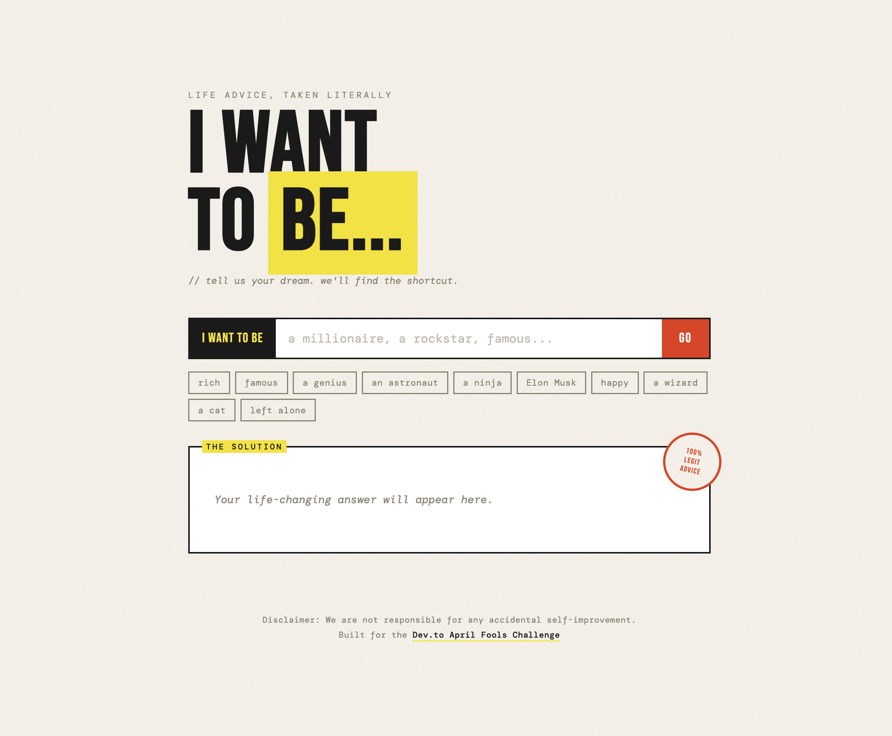

# I Want To Be...

**Technically correct advice. Guaranteed results.**

**[Try it live](https://einorde.github.io/i-want-to-be/)**



Tell us your dream. We'll find the shortcut.

> "I want to be rich" → "Change your name to Richard."
>
> "I want to be a ninja" → "Wear all black and move slightly too quietly. People will get the idea."
>
> "I want to be a cat" → "Knock something off a table and maintain eye contact. Cat energy."

## What is this?

A life advice generator that takes your dreams and fulfills them in the most literally correct way possible. Think of it as a genie who passed the bar exam for loopholes.

Built for the [Dev.to April Fools Challenge](https://dev.to/challenges/aprilfools-2026).

## Features

- 44 categories of literal life hacks covering everything from "rich" to "a wizard" to "left alone"
- 24 universal fallback answers for when your dream is too unique even for us
- Zero API calls — all advice is locally sourced and artisanally crafted
- Copy & Share buttons so you can spread the wisdom
- Confetti celebration because every answer deserves fanfare
- 100% Legit Advice (stamped and certified)

## Run locally

```bash
# Any static file server works
python3 -m http.server 8080
# or
npx serve .
```

Open [http://localhost:8080](http://localhost:8080).

## Deploy

Pure static HTML/CSS/JS — drop it on GitHub Pages, Netlify, Vercel, or literally anywhere that serves files.

## Tech stack

- HTML + CSS + vanilla JS
- Zero dependencies
- Zero build steps
- 100% legit advice

## Support

[](https://github.com/sponsors/Einorde)
[](https://ko-fi.com/einorde)

## License

MIT
